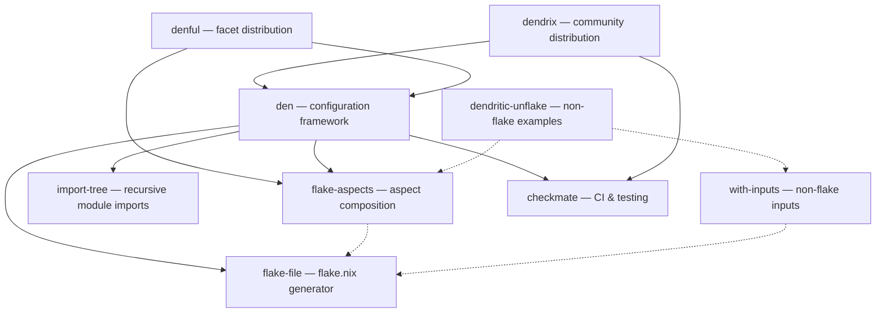

import { Card, CardGrid, LinkButton } from '@astrojs/starlight/components';

The Dendritic Nix ecosystem is a collection of focused, composable libraries that work independently or together. Each solves a specific problem in Nix configuration management.

## Dependency Graph

## The Libraries

<CardGrid>
  <Card title="flake-aspects" icon="puzzle">
    **The foundation.** Zero-dependency Nix library for composing aspects — transposition, dependency DAGs, parametric providers, nestable sub-aspects. Works with or without flakes.
    <LinkButton href="/ecosystem/flake-aspects/" variant="minimal" icon="right-arrow">Details</LinkButton>
  </Card>
  <Card title="den" icon="rocket">
    **The framework.** Context-aware configuration system with declarative pipelines, host/user schemas, and batteries included. Built on flake-aspects.
    <LinkButton href="/ecosystem/den/" variant="minimal" icon="right-arrow">Details</LinkButton>
  </Card>
  <Card title="flake-file" icon="document">
    **The generator.** Define flake inputs as typed Nix module options. Regenerate `flake.nix` with one command. Supports flakes, unflake, and npins.
    <LinkButton href="/ecosystem/flake-file/" variant="minimal" icon="right-arrow">Details</LinkButton>
  </Card>
  <Card title="dendrix" icon="star">
    **The distribution.** Community-driven index of Dendritic aspects — layers, import-trees, and templates for quick-start setups.
    <LinkButton href="/ecosystem/dendrix/" variant="minimal" icon="right-arrow">Details</LinkButton>
  </Card>
  <Card title="checkmate" icon="approve-check">
    **The CI toolkit.** Bundles treefmt and nix-unit for testing flakes with zero dependencies. Formatting checks, unit testing, GitHub CI templates.
    <LinkButton href="/ecosystem/checkmate/" variant="minimal" icon="right-arrow">Details</LinkButton>
  </Card>
  <Card title="import-tree" icon="seti:folder">
    **The loader.** Recursively import Nix modules from a directory tree. 180+ stars. The most widely adopted library in the ecosystem.
    <LinkButton href="/ecosystem/import-tree/" variant="minimal" icon="right-arrow">Details</LinkButton>
  </Card>
  <Card title="with-inputs" icon="setting">
    **The bridge.** Flake-compatible inputs resolution for non-flake Nix. Follows, overrides, and dependency introspection — without flake.nix.
    <LinkButton href="/ecosystem/with-inputs/" variant="minimal" icon="right-arrow">Details</LinkButton>
  </Card>
  <Card title="denful" icon="add-document">
    **The distribution.** LazyVim-like facets for common use cases. Pre-configured Dendritic modules that just work. *Work in progress.*
    <LinkButton href="/ecosystem/denful/" variant="minimal" icon="right-arrow">Details</LinkButton>
  </Card>
  <Card title="dendritic-unflake" icon="setting">
    **The proof.** Multiple example setups demonstrating Dendritic patterns without flakes — unflake, npins, builtins, froyo, falake.
    <LinkButton href="/ecosystem/dendritic-unflake/" variant="minimal" icon="right-arrow">Details</LinkButton>
  </Card>
</CardGrid>

## Design Philosophy

Every library in this ecosystem shares core principles:

- **Composable** — small, focused functions that combine naturally
- **No lock-in** — works with flakes, without flakes, with flake-parts, or standalone
- **Dependency-minimal** — most libraries have zero or near-zero external dependencies
- **Well-tested** — CI with checkmate, extensive test suites, real-world validation
- **Documented** — each library has its own documentation site

## Support the Ecosystem

<LinkButton href="/sponsor/" icon="heart" variant="secondary">Sponsor Development</LinkButton>
